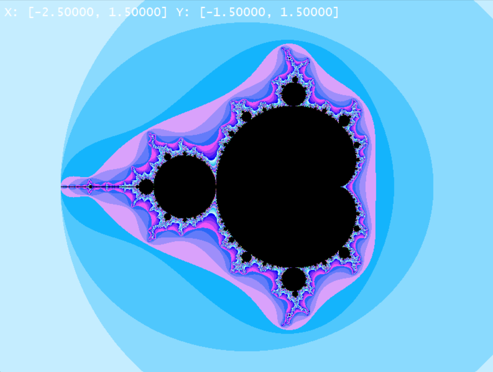
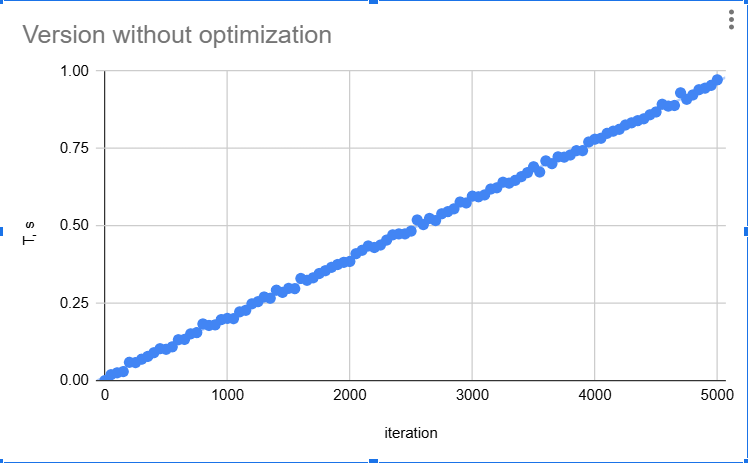
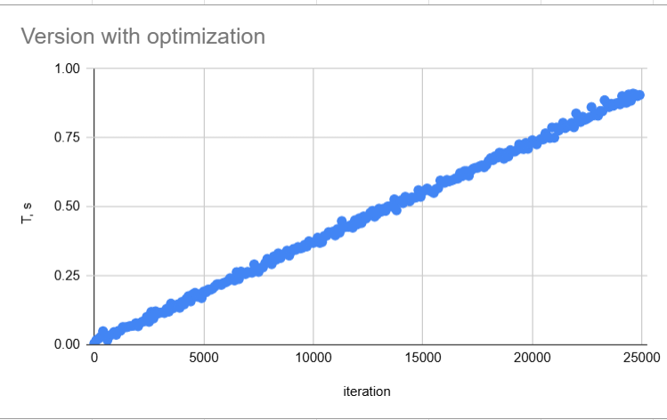

# Оптимизация алгоритма Мандельброта
🖥️ Графическая версия с интерактивным масштабированием
Проект включает интерактивную графическую версию с возможностью масштабирования и навигации по множеству Мандельброта. 
## Технические детали реализации:

Используется буферизация изображения для плавного отображения

Поддержка разрешения до 800x600 пикселей

Оптимизированный алгоритм перерисовки при изменении масштаба

Информационная панель с текущими координатами области просмотра

Для запуска графической версии используйте аргумент --graphics:


🚀 Три версии реализации
1. Базовый вариант (Simple)
Поточечный расчет без оптимизаций:

```c
int mandelbrot(float x0, float y0, int count_iter) {
    float x = 0, y = 0;
    for (int iter = 0; iter < count_iter; iter++) {
        float x2 = x*x, y2 = y*y;
        if (x2 + y2 >= R_MAX) return iter;
        y = 2*x*y + y0;
        x = x2 - y2 + x0;
    }
    return count_iter;
}
```
2. Групповая обработка (Grouped)
Обработка 8 точек одновременно:

```c
void mandelbrot(PointGroup *group) {
    float x[8] = {0}, y[8] = {0};
    bool active[8] = {true};
    for (int iter = 0; iter < MAX_ITER; iter++) {
        for (int i = 0; i < 8; i++) {
            if (!active[i]) continue;
            float x2 = x[i]*x[i], y2 = y[i]*y[i];
            if (x2 + y2 >= R_MAX) {
                active[i] = false;
                group->iter[i] = iter;
                continue;
            }
            y[i] = 2*x[i]*y[i] + groupl->y[i];
            x[i] = x2 - y2 + group->x[i];
        }
    }
}
```
3. Векторизация AVX (Intrinsics)
Использование 256-битных регистров:

```c
void mandelbrot_avx(PointGroup* group) {
    __m256 x = _mm256_setzero_ps();
    __m256 y = _mm256_setzero_ps();
    __m256 x0 = _mm256_load_ps(group->x);
    __m256 y0 = _mm256_load_ps(group->y);
    
    __m256 active = _mm256_set1_ps(-1.0f);
    __m256i res = _mm256_setzero_si256();
    
    for (int iter = 0; iter < MAX_ITER; iter++) {
        __m256 x2 = _mm256_mul_ps(x, x);
        __m256 y2 = _mm256_mul_ps(y, y);
        __m256 mask = _mm256_cmp_ps(_mm256_add_ps(x2, y2), 
               _mm256_set1_ps(R_MAX), _CMP_LT_OS);
        
        active = _mm256_and_ps(active, mask);
        res = _mm256_sub_epi32(res, _mm256_castps_si256(mask));
        
        __m256 xy = _mm256_mul_ps(x, y);
        x = _mm256_add_ps(_mm256_sub_ps(x2, y2), x0);
        y = _mm256_add_ps(_mm256_add_ps(xy, xy), y0);
        
        if (_mm256_testz_ps(active, active)) break;
    }
    _mm256_store_si256((__m256i*)group->iter, res);
}
```
📊 Результаты производительности


Графики зависимости времени выполнения от количества итераций:


Версия без оптимизации(обработка поэлементно)

Версия с оптимизацией интринсиками


Simple версия: k = 0.000190

Intrinsics версия: k = 0.000036

Ускорение в ~5.27 раз (теоретически возможное ускорение для AVX2 — 8x)

Производительность разных версий

❓ Почему не достигли ускорения в 8 раз?

Накладные расходы:

Операции управления масками (active, mask)

Преобразования типов (_mm256_castps_si256)

Особенности доступа к памяти:

Требование выравнивания данных для AVX

Дополнительные операции загрузки/сохранения


📌 Выводы
Достигнуто ускорение в 5.27 раз по сравнению с базовой версией


