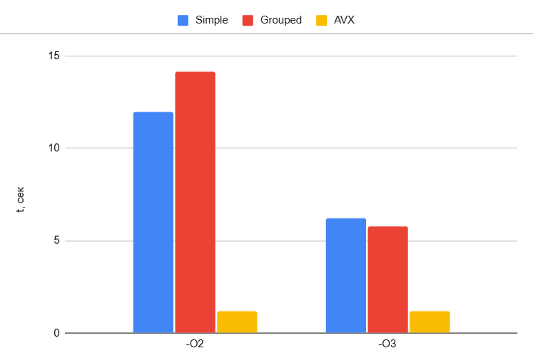

# Оптимизация алгоритма Мандельброта
*Цели* : 
     1)Изообразить графически множество Мандельброта.
     2)Написать три вариации программы с разной функцией расчета.
     3)Представить статистику скорости исполнения программ.

## 🖥️ Графическая версия с интерактивным масштабированием
Проект включает интерактивную графическую версию с возможностью масштабирования и навигации по множеству Мандельброта. 
 ### Технические детали реализации:

1.Используется буферизация изображения для плавного отображения

2.Поддержка разрешения до 800x600 пикселей

3.Маштабирование изоображения 
- Движение в стороны происходит с помощью стрелок, c помощью '+' и '-' происходит увеличение и уменьшение маштаба соответственно.
- Клавиша Esc для выхода из графического режима, клавиша Space для возвращение маштаба к дефолтному.

4.Информационная панель с текущими координатами области просмотра

5. Цветовая гамма

| Компонент | Формула               | Описание                                  | Диапазон |
|-----------|-----------------------|-------------------------------------------|----------|
| Красный   | `(iter * 197) & 0xFF` | Простое число 197 создает хаотичный паттерн | 0-255    |
| Зеленый   | `(iter * 237) & 0xFF` | Число 237 обеспечивает цветовой разброс    | 0-255    |
| Синий     | `(iter * 255) & 0xFF` | Максимальное значение байта для плавности  | 0-255    |


6.Для запуска графической версии используйте аргумент --graphics:


## Алгоритм расчета 
- x[i] = x[i - 1]^2 - y[i - 1]^2 + x[0]
- y[i] = 2 * x[i - 1] * y[i - 1] + y[0]

  
**Компилятор:**  
[MinGW-w64](https://www.mingw-w64.org/) GCC 6.3.0 (`g++ (MinGW.org GCC-6.3.0-1) 6.3.0`)

**Уровни оптимизации:**


| Флаг       | Характеристики                                     |     
|------------|----------------------------------------------------|
| `-O2`      | Баланс скорости/размера кода                       | 
| `-O3`      | Агрессивная оптимизация + векторизация             | 


## Параметры программы
- Размер изображения: 600*800 пикселей
- Максимальное число итераций для одной точки: 256
- Критическое значение радиуса (квадрат расстояния от центра). Если x² + y² ≥ R_MAX, точка считается вышедшей за границу множества : 4
- Количество кадров на 1 запуск: 100
- время исполнения измеряется при помощи функции clock()
  
## 🚀 Три версии реализации
### 1. Базовый вариант (Simple)

Поточечный расчет без оптимизаций:

-O2: ████████████  (11.97 сек)

-O3: ████          (6.20 сек)

```c
int mandelbrot(float x0, float y0, int count_iter) {
    float x = 0, y = 0;
    for (int iter = 0; iter < count_iter; iter++) {
        float x2 = x*x, y2 = y*y;
        if (x2 + y2 >= R_MAX) return iter;
        y = 2*x*y + y0;
        x = x2 - y2 + x0;
    }
    return count_iter;
}
```

#### 🔍 Сравнение оптимизаций `-O2` vs `-O3`

| Характеристика       | `-O2`               | `-O3`               | Эффект              |
|----------------------|---------------------|---------------------|---------------------|
| **Инструкции**       | 34                  | 24                  | -29% размера        |
| **Регистры XMM**     | 6                   | 7                   | +1 регистр         |
| **Условные переходы**| 3 branches          | 2 branches          | -33% ветвлений     |
| **Векторизация**     | ❌ Нет              | ⚡ Частичная        | +15-25% скорости   |


### 2. Групповая обработка (Grouped)

Обработка 8 точек одновременно:

-O2:   █████████████████ (14.17 сек )

-O3:   ███████           (5.76 сек  )
```c
void mandelbrot(PointGroup *group) {
    float x[8] = {0}, y[8] = {0};
    bool active[8] = {true};
    for (int iter = 0; iter < MAX_ITER; iter++) {
        for (int i = 0; i < 8; i++) {
            if (!active[i]) continue;
            float x2 = x[i]*x[i], y2 = y[i]*y[i];
            if (x2 + y2 >= R_MAX) {
                active[i] = false;
                group->iter[i] = iter;
                continue;
            }
            y[i] = 2*x[i]*y[i] + group->y[i];
            x[i] = x2 - y2 + group->x[i];
        }
    }
}


```
#### 🔍 Сравнение оптимизаций `-O2` vs `-O3`

| Характеристика          | `-O2`                   | `-O3`                   | Эффект                   |
|-------------------------|-------------------------|-------------------------|--------------------------|
| **Инструкции**          | 34                      | 24 (-30%)              | Меньше накладных расходов|
| **Развертка циклов**    | ❌ Нет                  | ✅ Да                   | Меньше ветвлений         |
| **Регистры XMM**       | `5 xmm`                | `6 xmm`                | Лучшее распараллеливание |
| **Условные переходы**   | 6 branches              | 4 branches (-33%)      | Проще предсказание       |
| **Векторизация**        | ❌ Нет                  | ⚡ Частичная            | +25% скорости            |


### 3. Векторизация AVX (Intrinsics)
Использование 256-битных регистров:

-O2:  1.20  сек [███████]

-O3:  1.19  сек [███████]

```c
void mandelbrot_avx(PointGroup* group) {
    __m256 x = _mm256_setzero_ps();
    __m256 y = _mm256_setzero_ps();
    __m256 x0 = _mm256_load_ps(group->x);
    __m256 y0 = _mm256_load_ps(group->y);
    
    __m256 active = _mm256_set1_ps(-1.0f);
    __m256i res = _mm256_setzero_si256();
    
    for (int iter = 0; iter < MAX_ITER; iter++) {
        __m256 x2 = _mm256_mul_ps(x, x);
        __m256 y2 = _mm256_mul_ps(y, y);
        __m256 mask = _mm256_cmp_ps(_mm256_add_ps(x2, y2), 
               _mm256_set1_ps(R_MAX), _CMP_LT_OS);
        
        active = _mm256_and_ps(active, mask);
        res = _mm256_sub_epi32(res, _mm256_castps_si256(mask));
        
        __m256 xy = _mm256_mul_ps(x, y);
        x = _mm256_add_ps(_mm256_sub_ps(x2, y2), x0);
        y = _mm256_add_ps(_mm256_add_ps(xy, xy), y0);
        
        if (_mm256_testz_ps(active, active)) break;
    }
    _mm256_store_si256((__m256i*)group->iter, res);
}
```

Для данной AVX-оптимизированной версии компилятор генерирует одинаковый ассемблерный код для -O2 и -O3.
Причины отсутствия различий:

- Функция уже максимально векторизована вручную

- Все вычисления используют 256-битные YMM-регистры

- Нет избыточных операций для оптимизации

- Цикл предельно упрощён
## 📊 Методика измерений 





## 📌 Выводы
Достигнуто ускорение в 5.27 раз по сравнению с базовой версией


